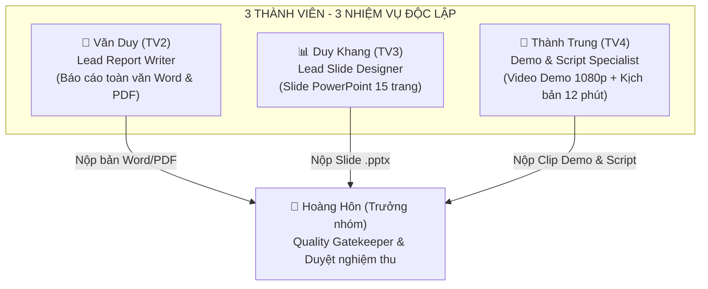

# KẾ HOẠCH HOÀN THIỆN ĐỒ ÁN MÔN HỌC MÁY HỌC
## ĐỀ TÀI: PHÂN TÍCH CẢM XÚC (SENTIMENT ANALYSIS) ĐÁNH GIÁ ITVIEC

- **Mục tiêu**: Hoàn thiện toàn bộ sản phẩm đồ án chuẩn bị báo cáo trước Hội đồng đánh giá.
- **Tiến độ kỹ thuật**: ✅ **100% Hoàn thành** (Pipeline tiền xử lý, trích xuất TF-IDF, huấn luyện 5 mô hình ML, đánh giá Final Test và Web Demo Streamlit).
- **Phân công giai đoạn cuối**: Chia **3 việc then chốt cho 3 thành viên**, Trưởng nhóm đóng vai trò kiểm duyệt chất lượng & nghiệm thu (Quality Gatekeeper).

---

---

## 👥 BẢNG PHÂN CÔNG NHIỆM VỤ CHI TIẾT TỪNG THÀNH VIÊN

---

### 1. 👑 HOÀNG HÔN (TRƯỞNG NHÓM)
* **Vị trí**: `Lead Reviewer, Quality Gatekeeper & Technical Governance`
* **Cam kết phạm vi công việc**:
  - ❌ **Không viết báo cáo**
  - ❌ **Không làm slide thuyết trình**
  - ❌ **Không chủ trì phần phản biện Q&A**
  - ✅ **Là người kiểm tra và duyệt nghiệm thu toàn bộ sản phẩm của nhóm trước khi nộp**

#### Nhiệm vụ cụ thể:
1. **Kiểm tra Báo cáo toàn văn**:
   - Đọc soát toàn bộ cuốn báo cáo do Văn Duy nộp.
   - Bắt lỗi chính tả, kiểm tra tính chuẩn xác của các con số (8.417 review, CV Macro F1 Logistic Regression 0.5727, Final Test Accuracy 73.74%, Macro F1 0.5714).
   - Yêu cầu sửa đổi nếu chưa đạt format chuẩn khoa học UIT.
2. **Kiểm tra Bộ Slide thuyết trình**:
   - Duyệt file Slide PowerPoint do Duy Khang nộp.
   - Đảm bảo đúng phong cách Dark-tech, bố cục thoáng, không chứa đoạn văn dài, đủ các biểu đồ 300 DPI từ `reports/figures/`.
3. **Kiểm tra Video Demo & Kịch bản**:
   - Xem và duyệt video clip do Thành Trung quay (đảm bảo rõ nét Full HD, âm thanh rõ, test đúng các ca câu review phức tạp).
   - Duyệt kịch bản phân vai và bộ câu hỏi phản biện.
4. **Duyệt xuất xưởng (Final Sign-off)**:
   - Là người bấm nút nộp bài cuối cùng đại diện cho nhóm.

---

### 2. 📝 VĂN DUY (TV2)
* **Vị trí**: `Lead Report Writer (Chuyên trách Viết Báo cáo Đồ án)`
* **Sản phẩm bàn giao**: **01 File Báo cáo toàn văn hoàn chỉnh (`.docx` và `.pdf`)** chuẩn mẫu 6 Chương theo đề cương `reports/De_Cuong_Do_An_Mon_Hoc_May_Hoc.md` (khoảng 30 – 40 trang).

#### Cấu trúc Báo cáo chi tiết Văn Duy chịu trách nhiệm:
* **Phần mở đầu**: Lời cam đoan, Lời cảm ơn, Mục lục, Danh mục bảng biểu và hình vẽ.
* **Chương 1: Tổng quan và Đặt vấn đề**: Bối cảnh phân tích cảm xúc ngành IT, mục tiêu phân loại 3 lớp, đối tượng nghiên cứu.
* **Chương 2: Dữ liệu và Tiền xử lý**:
  - Cấu trúc 8.417 review ITviec, phân tích phân bố sao rating (73.8% Positive, 19.5% Neutral, 6.8% Negative).
  - Pipeline tiền xử lý: Chuẩn hóa Unicode NFC, xử lý emoji/emojicon, teencode, tách từ `underthesea`, lọc từ dừng.
* **Chương 3: Trích xuất Đặc trưng & Thiết kế Mô hình**:
  - Trích xuất TF-IDF N-gram (1,2) 5.000 chiều.
  - Thiết kế 5 mô hình ML: Multinomial Naive Bayes, Logistic Regression, Linear SVM, Random Forest, Stacking Ensemble.
  - Kỹ thuật giải quyết mất cân bằng lớp: `class_weight='balanced'` vs `SMOTE` bọc trong Pipeline 5-fold CV.
* **Chương 4: Kết quả Thực nghiệm & Đánh giá**:
  - Bảng so sánh hiệu năng 5 mô hình trên tập Cross-Validation (Development).
  - Bảng số liệu kiểm thử trên Final Test độc lập (Accuracy 73.74%, Macro F1 0.5714, Weighted F1 0.7489).
  - Ma trận nhầm lẫn (Confusion Matrix) và phân tích bẫy Accuracy trên dữ liệu mất cân bằng.
* **Chương 5: Phân tích Lỗi (Error Analysis) & Insight Doanh nghiệp**:
  - Phân tích chi tiết 15 ca lỗi điển hình theo 3 nhóm nguyên nhân (review nhiều vế, nhãn nhiễu do rating, văn bản ngắn).
  - Trực quan hóa đám mây từ khóa (WordCloud) và phân tích cảm xúc theo 5 công ty lớn (FPT, NashTech, Bosch, VNG, KMS).
  - Mô tả kiến trúc và giao diện Web Demo Streamlit.
* **Chương 6: Kết luận & Hướng phát triển**:
  - Tóm tắt đóng góp của đồ án, hạn chế và hướng mở rộng (ABSA, LLM).

---

### 3. 📊 DUY KHANG (TV3)
* **Vị trí**: `Lead Slide Designer (Chuyên trách Thiết kế Slide)`
* **Sản phẩm bàn giao**: **01 File Slide Trình chiếu PowerPoint (`.pptx`)** gồm **đúng 15 slide** thiết kế chuẩn phong cách Dark-tech công nghệ, tinh gọn và cô đọng cho thời lượng bảo vệ **chuẩn 12 phút** (tạo vùng đệm an toàn 3 phút dự phòng nói chậm, cam kết không vượt khung 15 phút của Hội đồng).

#### Cấu trúc 15 Slide Duy Khang chịu trách nhiệm:
1. **Slide 1: Trang bìa**: Tên đề tài, Giảng viên hướng dẫn, Nhóm sinh viên thực hiện.
2. **Slide 2: Đặt vấn đề & Thách thức dữ liệu ITviec**: Bối cảnh phân tích cảm xúc tuyển dụng ngành IT; Thách thức mất cân bằng nghiêm trọng (11:1), teencode, từ lóng kỹ thuật Anh - Việt, cấu trúc đối lập khen/chê đan xen.
3. **Slide 3: Sơ đồ kiến trúc tổng thể (End-to-End Pipeline)**: Luồng dữ liệu hoàn chỉnh từ Thu thập $\to$ Tiền xử lý $\to$ Trích xuất đặc trưng TF-IDF $\to$ Huấn luyện ML & SMOTE $\to$ Ứng dụng Web.
4. **Slide 4: Tiền xử lý dữ liệu chuyên sâu**: Pipeline làm sạch văn bản, chuẩn hóa Unicode, emoji, teencode, tách từ `underthesea` và lọc từ dừng.
5. **Slide 5: Khám phá dữ liệu EDA (Exploratory Data Analysis)**: Phân bố 8.417 review theo nhãn sao (73.8% Tích cực, 19.5% Trung tính, 6.8% Tiêu cực); Độ dài văn bản và tương quan giữa các khía cạnh đánh giá.
6. **Slide 6: Trích xuất đặc trưng TF-IDF N-gram (1,2)**: Cấu hình `ngram_range=(1,2)`, `sublinear_tf=True`, `max_features=5000` và chiến lược chia tập Stratified 80/20.
7. **Slide 7: Thiết kế 5 mô hình ML & Kỹ thuật SMOTE**: Đánh giá 5 thuật toán (NB, LR, SVM, RF, Stacking); Kỹ thuật SMOTE bọc trong Pipeline theo từng fold CV chống rò rỉ dữ liệu.
8. **Slide 8: Bảng xếp hạng mô hình trên Development Set**: Bảng Leaderboard 5 mô hình (Cross-Validation Macro F1); Chứng minh Logistic Regression (`C=1.0`, SMOTE) đạt F1 cao nhất (**0.5727**).
9. **Slide 9: Kết quả Final Test độc lập & Ma trận nhầm lẫn**: Kết quả trên 1.683 mẫu khóa (Accuracy 73.74%, Macro F1 0.5714); Trực quan hóa Confusion Matrix và vạch trần bẫy Accuracy.
10. **Slide 10: Phân tích lỗi sai (Error Analysis)**: 3 nhóm nguyên nhân chính: review nhiều vế khen chê đan xen, label noise do rating sao, review ngắn thiếu ngữ cảnh.
11. **Slide 11: Khám phá Insight cảm xúc ngành IT**: Trực quan hóa WordCloud theo sắc thái cảm xúc; Khám phá thực trạng văn hóa làm việc, chế độ OT, đãi ngộ tại các tập đoàn hàng đầu (FPT, VNG, NashTech, Bosch, KMS).
12. **Slide 12: Giới thiệu ứng dụng Web Demo Streamlit**: Giao diện Dark-tech với 5 phân hệ: Tổng quan, Insight doanh nghiệp, Benchmark, Đánh giá lỗi, Dự đoán thời gian thực.
13. **Slide 13: Trực quan hóa đặc trưng kích hoạt**: Giải thích quyết định của mô hình thông qua các token TF-IDF nổi bật nhất trong câu.
14. **Slide 14: Đánh giá thực nghiệm, Bài học & Hạn chế**: Tổng kết các thành tựu kỹ thuật; Bài học kinh nghiệm về xử lý dữ liệu mất cân bằng; Các giới hạn hiện tại của mô hình.
15. **Slide 15: Kết luận, Hướng phát triển tương lai & Lời cảm ơn**: Định hướng mở rộng sang bài toán ABSA và LLM; Lời cảm ơn chân thành đến GVHD cùng Hội đồng đánh giá và chuyển sang phần Q&A / Live Demo.

---

### 4. 🎥 THÀNH TRUNG (TV4)
* **Vị trí**: `Live Demo Operator, Video Producer & Script Writer`
* **Sản phẩm bàn giao**:
  1. **01 Video Clip Demo Full HD (3 – 5 phút)** có thuyết minh rõ ràng.
  2. **Trực tiếp thao tác Live Demo** trên máy chiếu khi Hội đồng yêu cầu.
  3. **01 File Kịch bản thuyết trình (Script)** phân vai cho cả nhóm, căn chuẩn **chính xác 12 phút** (phòng hờ thời gian chậm tối đa 15 phút).
  4. **01 Bộ tài liệu câu hỏi phản biện & câu trả lời mẫu (Q&A Defense Guide)**.

#### Nhiệm vụ cụ thể:
1. **Quay Video Clip Demo (Full HD 1080p, 3–5 phút)**:
   - *Phần 1 (0:00 - 1:00)*: Trang Overview & Kiến trúc Pipeline.
   - *Phần 2 (1:00 - 2:00)*: Trang Insight doanh nghiệp, chọn công ty FPT/VNG, xem WordCloud.
   - *Phần 3 (2:00 - 2:45)*: Trang Benchmark & Đánh giá lỗi Final Test.
   - *Phần 4 (2:45 - 4:30)*: Trang Real-time Prediction. Test câu khó: *"Lương thấp, quản lý thiếu minh bạch và thường xuyên phải OT không lương."* $\to$ hiển thị nhãn **Negative (77.3%)**, bóc tách token TF-IDF kích hoạt.
   - *Phần 5 (4:30 - 5:00)*: Kết thúc, khẳng định app chạy mượt mà, sẵn sàng triển khai.
2. **Soạn Kịch bản Thuyết trình (Presentation Script) chuẩn 12 phút**:
   - Phân vai lời thoại chi tiết theo từng slide cho Duy, Khang, Trung (khóa chặt mốc thời gian 12 phút, mỗi slide chỉ 40-50 giây, lướt đúng trọng tâm).
   - Dự trù thời gian dôi dư 3 phút phòng khi nói chậm hoặc Hội đồng ngắt lời.
3. **Soạn Bộ câu hỏi phản biện (Q&A Guide)**:
   - Soạn sẵn các câu hỏi của Hội đồng (*Tại sao dùng Macro F1? Tại sao Logistic Regression lại vượt trội hơn Random Forest trên dữ liệu text? Xử lý rò rỉ dữ liệu của SMOTE thế nào?*) kèm câu trả lời mẫu để cả nhóm tự tin trả lời.

---

## ⏱️ BẢNG PHÂN BỔ THỜI GIAN CHUẨN 12 PHÚT (BUFFER 3 PHÚT)

| Phần | Nội dung | Các Slide | Thời lượng mục tiêu | Người trình bày gợi ý |
| :--- | :--- | :---: | :---: | :--- |
| **Phần 1** | Mở đầu, Bài toán & Kiến trúc hệ thống | Slide 1 $\to$ 3 | **1.5 phút** (90s) | Duy Khang (hoặc TV đại diện) |
| **Phần 2** | Tiền xử lý, EDA & Trích xuất TF-IDF | Slide 4 $\to$ 6 | **2.5 phút** (150s) | Văn Duy |
| **Phần 3** | 5 Mô hình ML, SMOTE, CV & Final Test | Slide 7 $\to$ 10 | **3.5 phút** (210s) | Duy Khang |
| **Phần 4** | Insight Doanh nghiệp, Web Demo Live | Slide 11 $\to$ 13 | **3.0 phút** (180s) | Thành Trung (thao tác Live Demo) |
| **Phần 5** | Bài học, Giới hạn, Hướng phát triển & Kết luận | Slide 14 $\to$ 15 | **1.5 phút** (90s) | Thành Trung (hoặc cả nhóm) |
| **TỔNG CỘNG** | **Toàn bộ bài báo cáo trước Hội đồng** | **15 Slides** | **12.0 phút** (720s) | **Dự phòng Buffer: 3 phút (An toàn tuyệt đối trong khung 15p)** |

---

## 🎯 BẢNG GIAO HẸN SẢN PHẨM CUỐI CÙNG (FINAL DELIVERABLES)

| STT | Sản phẩm bàn giao | Người phụ trách chính | Người nghiệm thu | Trạng thái |
| :---: | :--- | :--- | :---: | :---: |
| 1 | Báo cáo toàn văn hoàn chỉnh (`.docx` & `.pdf`) | **Văn Duy (TV2)** | Hoàng Hôn (TV1) | ⏳ Đang triển khai |
| 2 | Bộ Slide thuyết trình PowerPoint 15 trang (`.pptx`) | **Duy Khang (TV3)** | Hoàng Hôn (TV1) | ⏳ Đang triển khai |
| 3 | Video Demo Full HD 3–5 phút + Kịch bản 12 phút + Q&A | **Thành Trung (TV4)** | Hoàng Hôn (TV1) | ⏳ Đang triển khai |
| 4 | Toàn bộ Source Code, Model Joblib & Web Demo Streamlit | **Cả nhóm** | Hoàng Hôn (TV1) | ✅ **100% Hoàn thành** |
