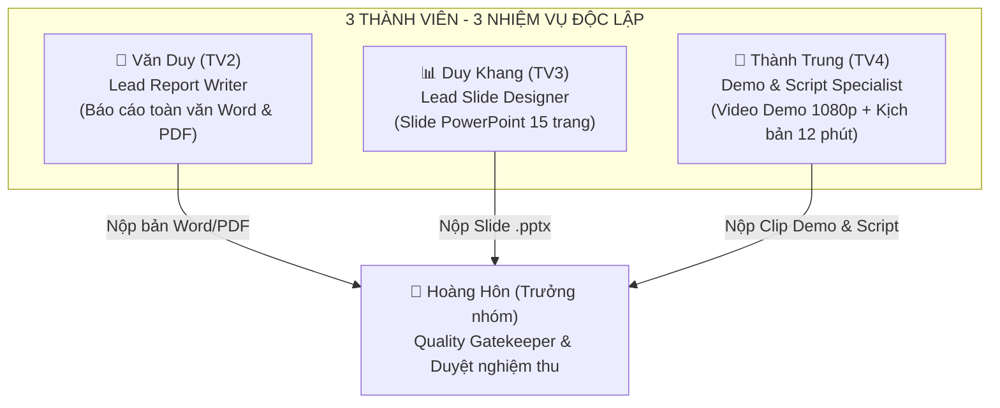

# KẾ HOẠCH & PHÂN CHIA CÔNG VIỆC ĐỒ ÁN MÔN HỌC MÁY HỌC
## ĐỀ TÀI: PHÂN TÍCH CẢM XÚC (SENTIMENT ANALYSIS) ĐÁNH GIÁ ITVIEC

- **Thời gian thực hiện:** 3 tuần (21 ngày)
- **Trạng thái dự án:** ✅ **Toàn bộ 4 phân hệ kỹ thuật (TV1 + TV2 + TV3 + TV4) HOÀN TẤT 100% | 🚀 GIAI ĐOẠN CUỐI: Phân chia 3 việc độc lập cho 3 thành viên**
- **Danh sách thành viên:**
  1. **TV1: Hoàng Hôn** (Trưởng nhóm) - `Lead Reviewer, Quality Gatekeeper & Technical Governance`
  2. **TV2: Văn Duy** - `Lead Report Writer (Chuyên trách Báo cáo Word & PDF)`
  3. **TV3: Duy Khang** - `Lead Slide Designer (Chuyên trách Slide PowerPoint)`
  4. **TV4: Thành Trung** - `Demo & Script Specialist (Chuyên trách Video Demo, Live Demo & Kịch bản)`

---

## 👥 I. BẢNG TIẾN ĐỘ & KẾT QUẢ KỸ THUẬT ĐÃ HOÀN THÀNH (PHASE 1 - 4)

| Thành viên | Phân công | Nhiệm vụ kỹ thuật đã hoàn thành | Sản phẩm kỹ thuật bàn giao | Trạng thái |
| :--- | :--- | :--- | :--- | :---: |
| **👑 TV1: Hoàng Hôn** *(Trưởng nhóm)* | **Business & Data Processing** | - Xây dựng module `src/preprocessing.py`, chuẩn hóa Unicode NFC, emoji, teencode, lọc stopwords, tách từ `underthesea`. - Làm sạch và gán nhãn 3 lớp cảm xúc cho toàn bộ 8.417 review. | `data/processed/reviews_cleaned.xlsx` (8.417 mẫu; Positive 73.8%, Neutral 19.5%, Negative 6.8%), 10 bộ từ điển `data/dictionaries/`. | ✅ **100%** |
| **👨‍💻 TV2: Văn Duy** | **Feature Engineering & EDA** | - Phân tích EDA, xuất 9 biểu đồ 300 DPI tại `reports/figures/`. - Xây dựng `src/features.py`, trích xuất TF-IDF N-gram (1, 2) 5.000 chiều. - Phân chia Stratified Split 80/20 (Dev: 6.731 mẫu / Final Test: 1.683 mẫu khóa chống rò rỉ). | Artifacts `models/` (`text_tfidf_vectorizer.joblib`, `train_test_features.joblib`), báo cáo `reports/eda_feature_engineering.md`. | ✅ **100%** |
| **👨‍💻 TV3: Duy Khang** | **ML Modeling & Tuning** | - Xây dựng `src/models.py`, chạy `03_sentiment_modeling_ml.ipynb`. - Thử nghiệm 5 thuật toán ML (MNB, LR, Linear SVM, RF, Stacking Ensemble) với `class_weight='balanced'` vs `SMOTE` qua Stratified 5-Fold CV. - Khóa model tốt nhất: Logistic Regression (`C=1.0`, SMOTE), CV Macro F1 **0.5727**. | `models/best_sentiment_model.joblib`, báo cáo `reports/modeling_hyperparameter_tuning.md`. | ✅ **100%** |
| **👨‍💻 TV4: Thành Trung** | **Evaluation, Insights & Web Demo** | - Đánh giá Final Test độc lập (1.683 mẫu): Accuracy **73.74%**, Macro F1 **0.5714**, Weighted F1 **0.7489** (độ lệch so với CV chỉ -0.0014, không overfitting). - Vẽ Confusion Matrix & Error Analysis 15 mẫu ca lỗi điển hình. - WordCloud & Case Study 5 công ty IT lớn. - Xây dựng Web Demo Streamlit tương tác 5 phân hệ. | `reports/evaluation/final_test_snapshot.json`, `reports/tv4_model_evaluation_error_analysis.md`, `reports/tv4_report_sections_5_6.md`, Web App `app.py`. | ✅ **100%** |

---

## 🎯 II. GIAI ĐOẠN HOÀN THIỆN: PHÂN CHIA 3 VIỆC CHO 3 THÀNH VIÊN
*(Áp dụng theo quy chuẩn phân công đã thực hiện thành công ở Đồ án NLP)*

---

### 1️⃣ VĂN DUY (TV2) — Chuyên trách Báo cáo toàn văn (Lead Report Writer)
* **Vị trí**: `Lead Report Writer`
* **Sản phẩm bàn giao**: **01 File Báo cáo toàn văn hoàn chỉnh (`.docx` và `.pdf`)** chuẩn đề cương [`reports/De_Cuong_Do_An_Mon_Hoc_May_Hoc.md`](De_Cuong_Do_An_Mon_Hoc_May_Hoc.md) (khoảng 30 – 40 trang).
* **Nhiệm vụ chi tiết:**
  1. **Tổng hợp nội dung 6 chương từ các tài liệu có sẵn:**
     * *Chương 1, 2, 3 (Tổng quan, Dữ liệu, EDA, Tiền xử lý, TF-IDF):* Lấy từ [`reports/eda_feature_engineering.md`](eda_feature_engineering.md).
     * *Chương 4 & 5.1 (5 mô hình ML, SMOTE vs Balanced, GridSearchCV):* Lấy từ [`reports/modeling_hyperparameter_tuning.md`](modeling_hyperparameter_tuning.md).
     * *Chương 5.2 (Kết quả Final Test, Confusion Matrix, 15 ca Error Analysis):* Lấy từ [`reports/tv4_model_evaluation_error_analysis.md`](tv4_model_evaluation_error_analysis.md).
     * *Chương 5.3 & 6 (Insight 5 công ty lớn, Kết luận & Hướng phát triển):* Lấy từ [`reports/tv4_report_sections_5_6.md`](tv4_report_sections_5_6.md).
  2. **Chèn biểu đồ và bảng số liệu:**
     * Lấy các biểu đồ 300 DPI tại thư mục [`reports/figures/`](figures/) (9 biểu đồ EDA, ma trận nhầm lẫn `tv4_final_test_confusion_matrix.png`, các WordCloud theo công ty).
  3. **Định dạng:** Format chuẩn học thuật UIT, mục lục tự động, danh mục bảng biểu và đối chiếu tính nhất quán số liệu (8.417 mẫu; CV Macro F1 0.5727; Final Test Macro F1 0.5714).

---

### 2️⃣ DUY KHANG (TV3) — Chuyên trách Thiết kế Slide (Lead Slide Designer)
* **Vị trí**: `Lead Slide Designer`
* **Sản phẩm bàn giao**: **01 File Slide Trình chiếu PowerPoint (`.pptx`)** gồm **đúng 15 slide** thiết kế chuẩn phong cách Dark-tech hiện đại, tinh gọn, cô đọng cho thời lượng bảo vệ **chuẩn 12 phút** (dư 3 phút buffer an toàn trong khung 15 phút).
* **Cấu trúc 15 Slide chi tiết:**
  * **Slide 1 - 3 (Mở đầu & Bài toán):** Tiêu đề đề tài & Thành viên $\to$ Đặt vấn đề & Thách thức dữ liệu ITviec (mất cân bằng 11:3:1) $\to$ Sơ đồ End-to-End Pipeline.
  * **Slide 4 - 6 (Dữ liệu & Đặc trưng):** Pipeline tiền xử lý tiếng Việt & trích xuất TF-IDF N-gram (1,2) 5.000 chiều $\to$ Thống kê EDA (phân bố rating, độ dài review, tương quan khía cạnh).
  * **Slide 7 - 9 (Mô hình & Huấn luyện):** Thiết kế thực nghiệm 5 thuật toán ML (MNB, LR, Linear SVM, RF, Stacking) $\to$ Xử lý mất cân bằng (`class_weight='balanced'` vs `SMOTE` bọc trong Pipeline 5-fold CV) $\to$ Lựa chọn mô hình tối ưu (**Logistic Regression `C=1.0`, SMOTE**).
  * **Slide 10 - 12 (Đánh giá Final Test & Lỗi):** Kết quả Final Test độc lập (Accuracy **73.74%**, Macro F1 **0.5714**) $\to$ Ma trận nhầm lẫn (Confusion Matrix) $\to$ Phân tích 3 nhóm nguyên nhân lỗi sai điển hình.
  * **Slide 13 - 14 (Insight & Demo):** Insight cảm xúc 5 công ty lớn (FPT, NashTech, Bosch, VNG, KMS) $\to$ Giới thiệu kiến trúc Web Demo Streamlit.
  * **Slide 15 (Tổng kết):** Đóng góp, hạn chế, hướng mở rộng (ABSA, LLM) $\to$ Lời cảm ơn & Chuyển sang phần Live Demo / Q&A.

---

### 3️⃣ THÀNH TRUNG (TV4) — Chuyên trách Demo, Video & Kịch bản (Demo & Script Specialist)
* **Vị trí**: `Live Demo Operator, Video Producer & Script Writer`
* **Sản phẩm bàn giao:**
  1. **01 Video Clip Demo Full HD (3 – 5 phút):** Thao tác mượt mà qua 5 phân hệ của Web Streamlit (`http://localhost:8501`), có thuyết minh rõ ràng.
  2. **01 File Kịch bản Thuyết trình (Script):** Phân chia lời thoại chi tiết cho các thành viên bám đúng 15 slide của Duy Khang, căn giờ chuẩn 12 phút.
  3. **01 Bộ câu hỏi phản biện & Câu trả lời mẫu (Q&A Defense Guide):** Soạn sẵn các câu hỏi Hội đồng hay hỏi (*Tại sao dùng Macro F1 thay vì Accuracy? Tại sao Logistic Regression tốt hơn Random Forest trên TF-IDF? Xử lý rò rỉ dữ liệu của SMOTE ra sao?*).
* **Nhiệm vụ Live Demo:** Chuẩn bị sẵn 4 tình huống test thực tế để gõ trực tiếp trên Web UI khi Hội đồng yêu cầu:
  * *Tích cực rõ ràng:* "Môi trường thân thiện, sếp tâm lý, chế độ bảo hiểm tốt."
  * *Tiêu cực rõ ràng:* "Lương thấp, bóc lột OT không lương, quản lý thiếu minh bạch."
  * *Nhiều vế đối lập:* "Môi trường học hỏi tốt nhưng lương thấp và ép OT liên tục."
  * *Châm biếm / Teencode:* "Cty rất tuyệt vời cho ai muốn thử thách độ kiên nhẫn =))."

---

### 👑 HOÀNG HÔN (TRƯỞNG NHÓM) — Quality Gatekeeper & Quản lý chung
* **Vị trí**: `Lead Reviewer, Quality Gatekeeper & Technical Governance`
* **Cam kết phạm vi:** Không viết báo cáo hay vẽ slide; tập trung điều phối và kiểm duyệt nghiệm thu chất lượng sản phẩm.
* **Nhiệm vụ chi tiết:**
  1. **Kiểm tra Báo cáo toàn văn:** Đọc soát bản Word/PDF của Văn Duy, bắt lỗi chính tả, đối chiếu tính chuẩn xác của các con số kỹ thuật.
  2. **Kiểm tra Bộ Slide thuyết trình:** Duyệt file PowerPoint của Duy Khang, đảm bảo đúng bố cục 15 slide, thoáng, hiển thị đủ biểu đồ 300 DPI.
  3. **Kiểm tra Video Demo & Kịch bản:** Xem và duyệt clip demo của Thành Trung (Full HD, âm thanh rõ, test đúng câu phức tạp); duyệt kịch bản phân vai và bộ Q&A.
  4. **Duyệt xuất xưởng (Final Sign-off):** Đại diện nhóm nộp toàn bộ sản phẩm hoàn chỉnh lên hệ thống môn học.

---

## ⏱️ BẢNG PHÂN BỔ THỜI GIAN THUYẾT TRÌNH CHUẨN 12 PHÚT (BUFFER 3 PHÚT)

| Phần | Nội dung | Các Slide | Thời lượng mục tiêu | Người trình bày gợi ý |
| :--- | :--- | :---: | :---: | :--- |
| **Phần 1** | Mở đầu, Bài toán & Kiến trúc Pipeline | Slide 1 $\to$ 3 | **1.5 phút** (90s) | Duy Khang (hoặc đại diện) |
| **Phần 2** | Tiền xử lý văn bản, EDA & Trích xuất TF-IDF | Slide 4 $\to$ 6 | **2.5 phút** (150s) | Văn Duy |
| **Phần 3** | 5 Mô hình ML, Xử lý mất cân bằng, CV & Final Test | Slide 7 $\to$ 10 | **3.5 phút** (210s) | Duy Khang |
| **Phần 4** | Insight Doanh nghiệp & Live Demo Web App | Slide 11 $\to$ 13 | **3.0 phút** (180s) | Thành Trung (thao tác Demo) |
| **Phần 5** | Bài học, Hạn chế, Hướng phát triển & Kết luận | Slide 14 $\to$ 15 | **1.5 phút** (90s) | Thành Trung (hoặc cả nhóm) |
| **TỔNG CỘNG** | **Toàn bộ bài báo cáo trước Hội đồng** | **15 Slides** | **12.0 phút** (720s) | **Dự phòng Buffer: 3 phút (An toàn trong khung 15p)** |

---

## 🎯 BẢNG GIAO HẸN SẢN PHẨM CUỐI CÙNG (FINAL DELIVERABLES)

| STT | Sản phẩm bàn giao | Người phụ trách chính | Người nghiệm thu | Trạng thái |
| :---: | :--- | :--- | :---: | :---: |
| 1 | Báo cáo toàn văn hoàn chỉnh (`.docx` & `.pdf`) | **Văn Duy (TV2)** | Hoàng Hôn (TV1) | ⏳ Đang triển khai |
| 2 | Bộ Slide thuyết trình PowerPoint 15 trang (`.pptx`) | **Duy Khang (TV3)** | Hoàng Hôn (TV1) | ⏳ Đang triển khai |
| 3 | Video Demo Full HD 3–5 phút + Kịch bản 12 phút + Q&A | **Thành Trung (TV4)** | Hoàng Hôn (TV1) | ⏳ Đang triển khai |
| 4 | Toàn bộ Source Code, Model Joblib & Web Demo Streamlit | **Cả nhóm** | Hoàng Hôn (TV1) | ✅ **100% Hoàn thành** |
